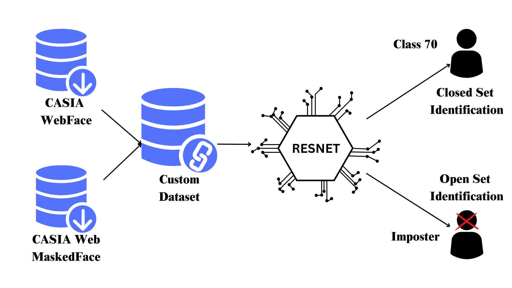

# Enhanced Face Recognition with Masks During COVID-19

From healthcare workers to working professionals, wearing a facial mask became a new normal owing to the COVID-19 pandemic, and hence, the need for reliable and efficient open set masked face identification systems has never been more critical. In this research, we successfully developed and implemented a robust model capable of identifying individuals and accurately detecting imposters even when facial coverings are present. 
To achieve this, we endeavored to create a custom dataset by combining two publicly available datasets and experimented with various state-of-the-art models through transfer learning to get the best solution. The results demonstrate the effectiveness of our approach, showcasing the potential of open set masked face identification systems in addressing security challenges in diverse domains, from healthcare facilities to corporate environments. We saw a 65% accuracy in closed set identification along with a **False Accept Rate (FAR) of 0.096** and **False Reject Rate (FRR) 0.102** of at a threshold of 0.94 for open set identification. Our findings aspire to contribute to a safer and more secure
future as we navigate the new normal of mask-wearing in a post COVID-19 world.

## Contributors

- Aryan Bhapkar - [LinkedIn](https://www.linkedin.com/in/aryan-bhapkar-730593200/)
- Manasi Pawaskar - [LinkedIn](https://www.linkedin.com/in/manasi-pawaskar-b1311820b/)
- Dev Chandan - [LinkedIn](https://www.linkedin.com/in/dev-chandan/)

## Dataset Innovation

Our dataset is a meticulously curated combination of the CASIA Web Face and CASIA Web Masked Face datasets. It was designed to train models to recognize individuals with a higher degree of accuracy, specifically tailored to the nuances introduced by mask-wearing. 

Access our comprehensive dataset [here](https://drive.google.com/file/d/1yMgSIg9bnUwzot8ZFcxXcjmXl_OSWiyT/view?usp=share_link).

## Research Presentations and Paper

- **Initial Findings Presentation**: An overview of our initial hypotheses and research approach. [View Presentation](https://www.canva.com/design/DAFfSnIccLQ/aK4Pn_sgNExJVzIVuFG9Vg/view?utm_content=DAFfSnIccLQ&utm_campaign=designshare&utm_medium=link&utm_source=editor)

- **Research Paper Presentation**: Detailed insights and references that underpin our research findings. [Explore the Presentation](https://docs.google.com/presentation/d/1nxSF2kWtjcuxbOpirdclmEtanVKwD6VsE2dbr2NGD-o/edit?usp=sharing)

- **Research Paper**: The full research paper documenting our methodology, data analysis, and conclusions. [Download PDF](https://drive.google.com/file/d/1DS-qcZlO-CYybxoWVvXHTjpTXjc6JJh1/view?usp=sharing)
